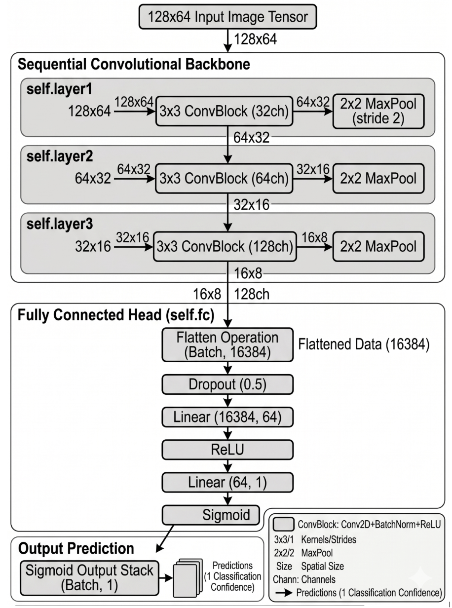
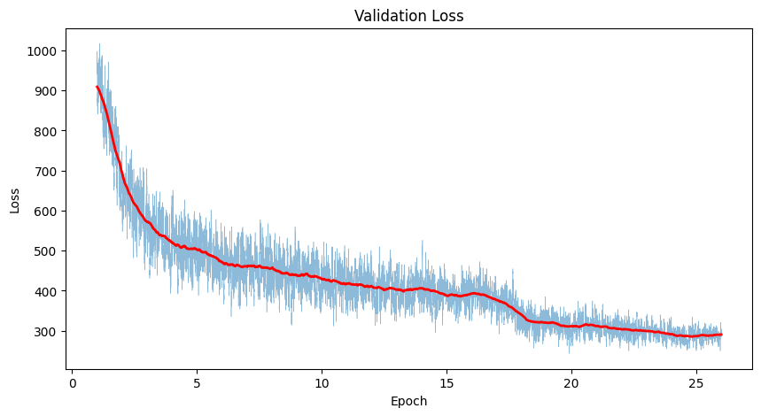

# Real-Time Human Classification: From Custom Architecture to State-of-the-Art
**Author:** Shudhanshu Ranjan Gupta, ECE , IIT Guwahati

## Objective
Real-time object detection for identifying humans in live video feeds from a camera.

## Approach
While doing this project I settled on 3 approaches :-

1. **(Baseline)**  Convolutional Neural Network (CNN) incorporating motion features 
Size: 4.6 mb

2. **(Custom)** Custom model inspired by Darknet-19 (Research paper: https://arxiv.org/pdf/1612.08242 based object detector)
Size: 79.5 mb

3. **(State-of-the-art)**
YOLOV8 
Size: 87 mb (large)

I systematically assess each model's capacity for localization, generalization, and temporal stability. My results demonstrate that my custom architectures converged successfully and rivaled the baseline (Nano and small) SOTA model in real-time inference and mean Average Precision (mAP) but it fails to provide robustness against scale variation and occlusion, Because of anchor-free architectures of modern YOLOv8 architecture (Specially large and extra large) and my biased data set of images closer to the camera.

## 1. Dataset and Preprocessing
### 1.1. Dataset
Models were trained and evaluated using a subset of COCO dataset 2017 (http://images.cocodataset.org/zips/train2017.zip Trained), (http://images.cocodataset.org/zips/val2017.zip, Valuation) specifically filtered for the 'person' class.
* **Training Samples:** 118K Annotated images
* **Validation Samples:** 5K Annotated images
* **Annotation Format:** XML, JSON

### 1.2 Preprocessing Pipeline
* **Resize:** Input images were resized to [Insert Resolution, e.g 416x416]
* **Normalization:** Pixel values normalized to [0,1]

Inorder and clean the dataset (ie. Remove other class) I used cleanup.py script to make it into instances_train2017.json file to isolate person with class ID: 1 and deleted the rest of it to optimise for disk space and training loop

## 2. Experimental Setup
For the complete Task (i.e Setup & Training of all the models) Is completely done on my own MacBook M2 air with MPS as device in pytorch.

**Total Training time:**
* CNN: 50 Min
* Darknet: 41 Hours
* Yolo-v8: 0 Min

## 3. Methodology & Model Architectures
### 3.1. CNN
This approach utilizes a Convolutional Neural Network designed to leverage temporal differences between frames.
#### 3.1.1 Training & Model architecture

**Hyper-parameters: 3 layer CNN | 1.4 mil parameters | Loss: criterion = nn.BCELoss()**

| Epoch | Loss |
|---|---|
| 1/10 | 0.5766 |
| 2/10 | 0.2793 |
| 3/10 | 0.1738 |
| 4/10 | 0.1401 |
| 5/10 | 0.0997 |
| 6/10 | 0.0828 |
| 7/10 | 0.0503 |
| 8/10 | 0.0351 |
| 9/10 | 0.0524 |
| 10/10 | 0.0365 |

**Input:** Video / Live feed

**Output:** Take the video in check where the movement is, Draws a box of dimension 64 x 128 passes that through the CNN and checks if the probability is greater than 0.7, if yes draw the box
**Post processing:** Removes intersecting boxes if their area of intersection is greater than 0.7

### 3.2. Custom Model
The Model utilises 19 Convolution layers with maxpooling layers with help of anchors and extract features
#### 3.1.1 Training & Model architecture

**Hyper-parameters: 19-layer CNN | ~21 mil parameters**

### Loss

**Input:** Video / Live feed

**Output:** Takes the video frame, pads and resizes it to 416x416, passes it through the Model and checks if the probability (confidence) is greater than 0.7. If yes, it decodes the bounding box coordinates using anchor boxes and draws a green box on the frame.

**Post processing:**
1. Removes intersecting boxes if their area of intersection (IoU) is greater than 0.3 using Non-Maximum Suppression (NMS).
2. Stabilizes the boxes across frames by matching centroids (within 100 pixels) and smoothing their position and size using previous track history.

### 3.3. YOLOV8
Imported the model from ultralytics answer the confidence Score at 0.55 It has zero post production

## 4. Challenges & Hardware optimisations
### 4.1 Engineering Challenges & Solutions

* **Training Convergence & Learning Rate Decay:**
  * **Issue:** During the extended training run, monitoring the loss curve revealed that the model was plateauing and struggling to converge fully after the initial 20 epochs.
  * **Solution:** Rather than waiting for CosineAnnealing of learning rate 1e-4 With weight decay 5e-4, I utilized the model's checkpointing system. I halted training, manually changed the learning rate to 1e-5, and resumed training from the latest checkpoint. This fine-tuning adjustment allowed the model to successfully navigate the local minima and reach convergence.

* **Mitigating Scale Bias via Dynamic Padding:**
  * **Issue:** During live webcam testing, the model struggled to detect objects close to the camera. This was traced back to a scale bias in the COCO training dataset, which predominantly features humans at a medium to far distance.
  * **Solution:** Instead of undergoing a massive dataset augmentation and retraining process, I implemented a dynamic preprocessing step in the inference pipeline. By adding calculated padding around the live frame before feeding it to the model, the objects within the image were effectively scaled down to match the distance distribution the model was trained on, instantly restoring detection accuracy.

* **Temporal Jitter & Algorithmic Smoothing:**
  * **Issue:** Because the model performs independent inference on each frame, the resulting bounding boxes suffered from high-frequency jitter, making the video output visually unstable.
  * **Solution:** I engineered a smoothing algorithm by maintaining a state history of past bounding box coordinates, the script applies linear interpolation across a sliding window of frames. This effectively averages out the jitter, resulting in a smooth, professional tracking box across the video feed.

### 4.2 Hardware Optimization & Memory Management
The entire pipeline-from data processing to model training and inference-was executed locally on consumer hardware, requiring strict resource management:
* **Apple Silicon Acceleration:** Trained locally on an Apple MacBook Air (M2 chip). To bypass CPU bottlenecks, I utilized PyTorch's Metal Performance Shaders (mps) backend, heavily leveraging the M2's unified GPU architecture to accelerate tensor operations.
* **Memory Profiling:** Training on an 18GB dataset locally on a unified memory architecture poses a high risk of out-of-memory (OOM) crashes. Through iterative testing, the BATCH_SIZE was strictly capped at 32. This was the optimal threshold to maximize GPU utilization while actively preventing macOS from utilizing SSD swap memory, which would have catastrophically degraded training speeds. By optimizing batch size and the mps backend, 27 epochs completed in approximately 41 hours

## 5. Results and Comparative Analysis
**DEMO-**

<video src="../assets/demo.mp4" autoplay loop muted playsinline width="100%"></video>

<!-- [INSERT MP4 HERE: Output video in CNN file] -->

## 6. Comparative Analysis

| Feature | Moving CNN | Darknet-Based Model | YOLOV8 |
|---|---|---|---|
| Accuracy (mAP) | Very low | 68% | 94% |
| Inference Time (ms) | Real time | Real time | Real time |
| Model Size (MB) | 4MB | 80MB | 166 MB |
| Real-Time Feasibility | yes | yes | yes |

## 7. Learnings and Limitations
Transitioning this project from a theoretical classification task to a stable, real-time video inference pipeline presented several distinct engineering challenges..

**Core Technical Takeaways:**
* **Data Engineering:** Writing the cleanup.py script to isolate the "Person" class taught me that curating, pruning, and understanding the distribution of your dataset is just as important-if not more so-than the model architecture itself.
* While implementing the State-of-the-Art YOLOv8 model was incredibly fast, building the Darknet-19 backbone from the ground up provided an invaluable, deep-level understanding of how anchor boxes are calculated, how grid cells operate, and the complex tensor reshaping required to extract bounding box coordinates from a neural network.
* **Real-World Deployment vs. Benchmark Metrics:** A model can have a high validation accuracy on paper, but real-world deployment on a live webcam feed requires active preprocessing (padding) and post-processing (temporal smoothing) to create a genuinely usable product.

**Limitations**
* Only detects at one scale (13x13 grid)
* Not very good at detecting small/distant persons
* Depends heavily on anchor selection
* Not as advanced as modern YOLO versions
